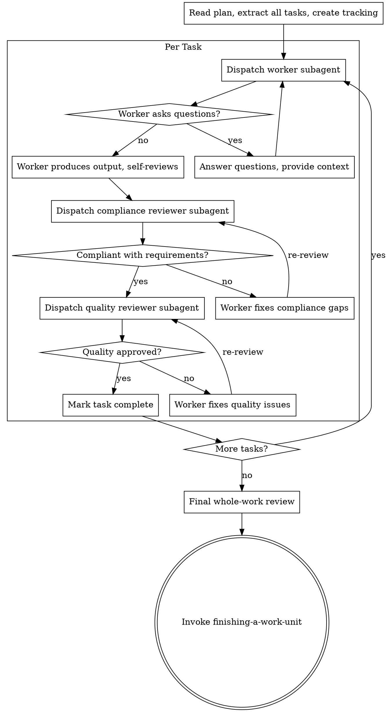

# Subagent-Driven Execution

Execute a plan with fresh subagents per task and strict review gates. Works for software implementation and knowledge-work (research, drafting, analysis, synthesis).

## Required Start

Announce: `I'm using subagent-driven-execution to execute this plan.`

## Core Flow



1. Read the plan once and extract all tasks.
2. Create task tracking for all tasks.
3. For each task:
   - Dispatch a worker subagent with full task text and minimal required context.
   - Resolve worker questions before the worker proceeds.
   - Require worker verification evidence (tests pass, claims are supported, output meets criteria).
   - Run compliance review: does the output fulfill the plan task's requirements?
   - If compliance fails, return to worker and re-review.
   - Run quality review: is the output high-quality for its domain?
   - If quality fails, return to worker and re-review.
   - Mark task complete: update the task's checkbox in plan.md from `- [ ]` to `- [x]`. If `state.md` exists with a plan status section, update it to reflect the completed task.
   - For complex or high-risk tasks, validate the approach against requirements and consider simpler alternatives before or after the worker's output.
4. Run final whole-work review.
5. Invoke `finishing-a-work-unit`.

## Worker and Reviewer Roles by Domain

### Software Tasks

| Role | Responsibility |
|---|---|
| Worker (implementer) | Writes code, runs tests, self-reviews against spec |
| Compliance reviewer | Spec review: does the implementation match requirements? |
| Quality reviewer | Code quality review: is the code clean, maintainable, and correct? |

For frontend/UI tasks, apply `frontend-design` standards in the quality review.

### Knowledge-Work Tasks

Knowledge-work covers: research reports, strategic memos, product analyses, competitive assessments, data synthesis, written recommendations, and similar outputs.

| Role | Responsibility |
|---|---|
| Worker (producer) | Drafts prose, researches topics, analyzes data, synthesizes findings |
| Compliance reviewer | Requirements review: does the output fulfill the plan task? Does it address all required points, cover the assigned scope, and match the requested format? |
| Quality reviewer | Output quality review: is it clear, accurate, complete, and fit for the intended audience? Are claims supported? Is the argument logically sound? Is the prose professional? |

The prompt templates in `./implementer-prompt.md`, `./spec-reviewer-prompt.md`, and `./code-quality-reviewer-prompt.md` are written for software tasks. For knowledge-work tasks, adapt the implementer pattern: replace "write code" with "draft/research/analyze", replace "tests pass" with "claims are cited/supported", and replace "spec compliance" with "requirements coverage".

## Parallel Waves (default for independent tasks)

When tasks are independent and touch disjoint files or disjoint subject areas, dispatch them as a wave — this is the preferred mode, not a special case. Sequential execution is the fallback for dependent tasks, not the default.

**Decision rule:** Before starting execution, group tasks into waves based on file overlap and state dependencies (software) or content dependencies and shared source material (knowledge-work). Tasks with no shared files, no sequential dependency, and no shared intermediate conclusions belong in the same wave.

1. Build a wave of independent tasks.
2. Dispatch all workers in a **single message** with multiple parallel Agent tool calls. Do not stagger across multiple messages.
3. Review each task with the same two-stage gate.
4. Run integration verification after the wave completes (software: test suite; knowledge-work: cross-section consistency check).
5. Update all completed task checkboxes in plan.md (`- [ ]` → `- [x]`) and sync state.md if present.
6. Proceed to the next wave.

If any overlap or shared-state risk exists within a wave, move the conflicting task to the next sequential wave.

**Why single-message dispatch matters for cost:** All subagents share the same cached system prompt prefix. Dispatching them simultaneously in one message means every agent gets a cache hit on that prefix and only pays for its small unique task prompt. Staggered dispatch provides no additional benefit and wastes wall-clock time.

## E2E Process Hygiene (Software Tasks Only)

When dispatching subagents that start background services (servers, databases, queues):

Subagents are stateless — they do not know about processes started by previous subagents. Accumulated background processes cause port conflicts, stale responses, and false test results.

Include in the subagent prompt for any E2E or service-dependent task:

**Unix/macOS:**
```
Before starting any service:
1. Kill existing instances: pkill -f "<service-pattern>" 2>/dev/null || true
2. Verify the port is free: lsof -i :<port> && echo "ERROR: port still in use" || echo "Port free"

After tests complete:
1. Kill the service you started.
2. Verify cleanup: pgrep -f "<service-pattern>" && echo "WARNING: still running" || echo "Cleanup verified"
```

**Windows:**
```
Before starting any service:
1. Kill existing instances: taskkill /F /IM "<process-name>" 2>nul || echo "No existing process"
2. Verify the port is free: netstat -ano | findstr :<port> && echo "ERROR: port still in use" || echo "Port free"

After tests complete:
1. Kill the service you started.
2. Verify cleanup: tasklist | findstr "<process-name>" && echo "WARNING: still running" || echo "Cleanup verified"
```

Exception: persistent dev servers the user explicitly keeps running — document them in `state.md`.

## Handling Worker Status

Worker subagents report one of four statuses. Handle each appropriately:

**DONE:** Proceed to compliance review.

**DONE_WITH_CONCERNS:** The worker completed the work but flagged doubts. Read the concerns before proceeding. If the concerns are about correctness or scope, address them before review. If they're observations (e.g., "this section is getting long" or "this file is getting large"), note them and proceed to review.

**NEEDS_CONTEXT:** The worker needs information that wasn't provided. Provide the missing context and re-dispatch.

**BLOCKED:** The worker cannot complete the task. Assess the blocker:
1. If it's a context problem, provide more context and re-dispatch with the same model.
2. If the task requires more reasoning, re-dispatch with a more capable model.
3. If the task is too large, break it into smaller pieces.
4. If the plan itself is wrong, escalate to the user.
5. If the user is unavailable and the task is non-critical: document the block in `state.md` and advance to the next independent task.

**Never** ignore an escalation or force the same model to retry without changes. If the worker said it's stuck, something needs to change. Never silently skip or mark a blocked task complete.

## Hard Rules

- **Software only:** Do not execute implementation on `main`/`master` without explicit user permission.
- Do not skip compliance review.
- Do not skip quality review.
- Do not accept unresolved review findings.
- Do not ask subagents to read long plan files when task text can be passed directly.

## Context Isolation

Never forward parent session context or history to subagents. Construct each subagent's prompt from scratch using only:
- Task text
- Acceptance criteria
- Needed file paths or source material
- Relevant constraints

Exclude unrelated prior assistant analysis and old failed hypotheses. Subagents must not receive conversation history, prior reasoning chains, or context from other subagent runs.

**Why this is also the cache-optimal approach:** All subagents share the same system prompt prefix, which the API caches. Keeping each subagent's input as `[cached system prompt] + [small unique task prompt]` means every agent hits the cache for the heavy shared prefix and only pays full input token price for its small task-specific tail. Forwarding parent conversation history would make each subagent's prefix unique, breaking cache sharing and multiplying input costs across the wave.

## Subagent Skill Leakage Prevention

Subagents can discover austinpowers skills via filesystem access and invoke them, causing a focused worker to behave as a workflow orchestrator. Every subagent prompt MUST include this instruction:

> You are a focused subagent. Do NOT invoke any skills from the austinpowers plugin. Do NOT use the Skill tool. Your only job is the task described below.

## Model Selection for Agent Tool Calls

Choose model based on task type when dispatching subagents via the Agent tool:

| Model | Use for |
|---|---|
| `haiku` | File reads, summarization, log scanning, patch verification — output is data, not decisions |
| `sonnet` | Default for all implementation and production tasks |
| `opus` | Architecture analysis, complex spec review, multi-system debugging, high-stakes knowledge-work synthesis, any task requiring reasoning across many constraints at once |

Apply via the `model` parameter in Agent tool calls. Default to `sonnet` when uncertain. Only upgrade to `opus` when the task is genuinely reasoning-heavy — not just large.

## Prompt Templates

The following templates are available and written for software tasks. Adapt them for knowledge-work by substituting domain-appropriate roles and verification criteria (see "Worker and Reviewer Roles by Domain" above):
- `./implementer-prompt.md`
- `./spec-reviewer-prompt.md`
- `./code-quality-reviewer-prompt.md`

## Integration

- Software tasks: set up workspace first with `using-git-worktrees`.
- Software tasks: use `requesting-code-review` templates for quality review structure.
- Knowledge-work tasks: use an output quality review — is the deliverable clear, accurate, complete, and audience-appropriate?
- Finish with `finishing-a-work-unit`.
